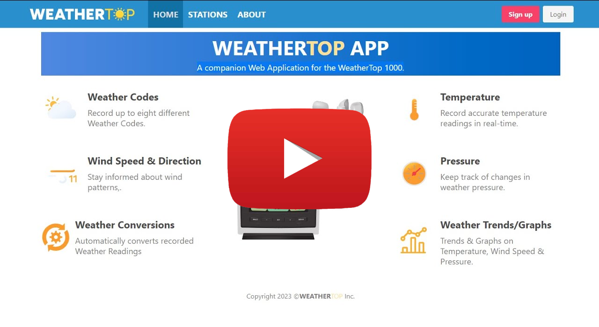

<a name="readme-top"></a>
<!-- PROJECT SHIELDS -->
<!-- PROJECT LOGO -->
<br />
<div align="center">
  <h1 align="center">Web Development II</h1>
    
</div>
<!-- TABLE OF CONTENTS -->
<details>
  <summary>Table of Contents</summary>
  <ol>
    <li><a href="#about-the-project">About The Project</a></li>
    <li><a href="#live-demo">Live Demo</a></li>
    <li><a href="#video-walk-through">Video Walk Through</a></li>   
    <li><a href="#installation">Installation</a></li>
    <li><a href="#contact">Contact</a></li>
  </ol>
</details>

<!-- ABOUT THE PROJECT -->
## About The Project
WeatherTop Inc. produce a modular weather station called the WeatherTop 1000. This lowcost device takes a set of meteorological readings and displays these on a simple LCD display. WeatherTop Inc. are seeking a Web companion application for the device. This document outlines my submission for this Assignment.
| Developed With| Templated With |  Styled With | 
| :----:        |    :----:   |  :----:   |
|        |        |         |
<p align="right">(<a href="#readme-top">back to top</a>)</p>

<!-- LIVE DEMO -->
## Live Demo
Link: [https://weathertopv2kg.glitch.me/](https://weathertopv2kg.glitch.me/)
<p align="right">(<a href="#readme-top">back to top</a>)</p>

<!-- VIDEO -->
## Video Walk Through
<a href="https://youtu.be/kmqXVC0wVdA" target="_blank">
 
</a>
<p align="right">(<a href="#readme-top">back to top</a>)</p>

### Installation

To get a copy of the project running on your system, navigate to the project directory in a command prompt/shell and run the following:
  ```
    npm install
  ```
This will install all dependencies in package-lock.json

After dependency installation has completed run
  ```
  npm run start
  ```
This will load the application and start a local server on port 4000.
  ```
  http://localhost:9000/
  ``` 
<p align="right">(<a href="#readme-top">back to top</a>)</p>


<!-- CONTACT -->
## Contact

Your Name - Kieron Garvey

Project Link: [https://github.com/ki321g/WeatherTOP-V2/](https://github.com/ki321g/WeatherTOP-V2)]

<p align="right">(<a href="#readme-top">back to top</a>)</p>

